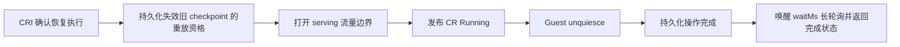

# Cellbox 启动与 Resume 性能优化报告

报告日期：2026-10-05。代码基准：`cf8a740`；性能数据来自 2026-10-03 至 2026-10-04 的已有实测。本次整理没有重新运行压测，也没有修改运行环境。

## 1. 主要结果

Cellbox 的优化分为两条路径：启动侧减少控制面请求、文件交付和元数据写入；resume 侧提前准备 Pod 和 checkpoint 缓存，并缩短恢复后的确认与通知路径。

| 场景 | 优化前或中间版本 | 最近实测结果 | 数据边界 |
| --- | --- | --- | --- |
| 新建并准备 CoCell 环境 | 早期单次 53.208 秒；#19 后 5 次中位数 4.226 秒 | #20 排除首轮预热后的 3 次中位数 **1.956 秒**，范围 1.910–2.358 秒 | 联合 Cellbox、Guest 和 CoCell 优化；已有镜像缓存 |
| 元数据改造前后的新建 | #20 的直接前测 3 次中位数 4.717 秒 | 状态拆分与 API 鉴权路径调整后，3 次中位数 **2.551 秒**，观察降幅 45.9% | 顺序部署测量；之后移除 Guest token 才得到 1.956 秒 |
| Cellbox 普通热 resume | #21 前的 CoCell 项目 resume 单次为 4.067 秒，属于更外层口径 | #21 最终 5 组双并发 / 10 次，**P50 0.936 秒**，范围 0.824–1.037 秒 | 命中预热池和节点 checkpoint 缓存；8/10 请求低于 1 秒 |
| 长历史双并发热 resume | 压缩前中间版本发现历史增长会拖慢元数据提交 | 最终 20 组 / 40 次，**P50 1.123 秒、P95 1.234 秒**，最大 1.399 秒 | 每个 Box 先执行 200 次命令；包含运行时压力，40/40 均超过 1 秒 |
| 节点 checkpoint 缓存丢失 | 需要从 OSS 回源，不能计入热恢复样本 | 最终两次 **1.988 / 1.975 秒** | 内存状态保持；不是重新启动应用 |

新建与 resume 已明显缩短，但现有结果不能支持“所有启动或双并发恢复稳定低于 1 秒”。新建数据是小样本；热 resume 的结果依赖预热命中、兼容模板和节点缓存。这里的“最近”指最近保存的测试数据，当前 HEAD 在后续正确性修复后的性能尚未单独重测。来源：[S2]、[S3]、[S4]。

## 2. 测量范围与口径

本文的“启动”指新建 Box 并准备可使用的环境，不是 Cellbox API 服务进程自身的启动时间。主要覆盖 Kubernetes resumable provider、gVisor 同节点 checkpoint/resume，以及 CoCell 的接入开销；Docker 启动没有足够对照数据。

| 指标 | 起点与终点 | 不能替代的指标 |
| --- | --- | --- |
| Pod 启动 / Pod Ready | Pod 创建至容器启动、首次 Ready，各自记录 | Cellbox 操作完成、应用可用 |
| CR `Running` | Controller 确认执行状态并发布生命周期状态 | Pod `Ready` condition；二者在当前实现中独立 |
| Cellbox 操作服务端耗时 | `cellbox.accept_*` 开始至 `cellbox.persist_completion` 完成 | 客户端观察和首次业务 HTTP 响应 |
| 热 resume 端到端耗时 | 客户端提交 resume HTTP 至恢复后首次业务 HTTP 响应 | CoCell 会话连接或真实模型首 token |
| CoCell 新建 / 项目 resume | 产品操作开始或客户端提交，至项目环境就绪；每组单独注明 | 单独的 Cellbox provider 或 gVisor 耗时 |
| Archive restore | 从文件归档创建并恢复新的环境 | 恢复原 Box 的进程内存 |

**Archive restore 与 memory resume 分开统计。** 早期报告中的 archive restore 为单次 50.058 秒，#19 后两次为 6.555 / 6.676 秒。它恢复文件到新环境，不能作为 #21 秒级内存 resume 的优化前基线。来源：[S1]、[S2]。

新建主要测试条件是已有镜像缓存和同节点共享挂载。#21 的运行测试在 2 vCPU、约 8 GiB 内存的 k3s 节点上执行，两个恢复请求通过 barrier 同时提交。热样本要求预热 Pod 和节点缓存均命中；预热池准备、此前 checkpoint 和缓存准备不在 resume 请求计时内。这些工作提前执行，仍占用实际资源。[S4]

全文的 P50 / P95 按 nearest-rank 计算：对排序后的 N 个请求取第 `ceil(p × N)` 个值，与原测试摘要一致；“中位数”则取标准中位数，偶数样本取中间两项均值。10 次热 resume 的标准中位数为 0.936300 秒，40 次长历史测试为 1.123949 秒。阶段表采用标准中位数，不把各阶段中位数之和当成整体 P50。

## 3. 优化前：哪些阶段耗时久

### 3.1 Pod 已经就绪，环境仍花了约 53 秒

2026-10-03 的一次原始新建采样总耗时为 53.208 秒：

| 阶段 / 检查点 | 实测 | 说明 |
| --- | ---: | --- |
| 创建并准备环境 | 46.754 秒 | 包含 Cellbox、文件和凭证交付、产品初始化等，不等于纯 Pod 启动 |
| 验证环境 | 6.447 秒 | 上层环境验证路径 |
| Pod 创建至首次采到 Ready | 约 1 秒 | 镜像已缓存；Kubernetes 时间戳精度有限 |
| Guest 直接请求 | Pod IP 中位数 2 ms；Service DNS 中位数 3 ms | 各 5 次请求 |
| 经 Cellbox API 读文件 | 中位数 1,200 ms | 5 次请求；控制面路径明显慢于 Guest 本身 |

两个产品阶段相加为 53.201 秒，与总计相差 7 ms；该差额未归入上述阶段。

Pod 很快就绪，但大量时间花在就绪后的初始化和控制面调用。这意味着只优化镜像拉取或 gVisor 冷启动，无法解释或消除这次 53 秒的主要开销。

当时的调用链存在以下放大因素：

- Kubernetes 客户端沿用 5 QPS / Burst 10；一次 Guest 请求的旧路径包含约 11 次 Kubernetes GET，另有 token exec。按 6 次 CR GET / 5 QPS 估算的 1.2 秒与文件读取实测吻合，这是代码和时延支持的推断，并非隔离变量后的 A/B 结论。
- 每次 Guest 连接重复解析状态和取得 token；内部 App Server 连接还需生成并持久化浏览器 Route/Grant。
- 多个初始化文件和凭证逐个传输，串行 RPC 累积延迟；目录准备、租约和额外验证请求也增加往返。
- 状态轮询争用初始化所用的同一个客户端 QPS，并反复复制、观察和写入状态。

该采样使用 500 ms 项目详情轮询和 Pod 采样，原记录明确指出轮询可能放大耗时。因此 53.208 秒是一次可追溯的历史观测，不是稳定基线或生产分位数。另一份早期总结记录了 54.665 秒单次新建，本文未把两次不同采样合并成一个性能分布。来源：[S1]；原始证据 E1。

### 3.2 第一轮缩短到 4 秒后，聚合元数据成为主要瓶颈

#19 的一次 4.226 秒 CoCell 服务端新建，Cellbox 阶段如下：

| Cellbox 阶段 | 耗时 | 主要内容 |
| --- | ---: | --- |
| 接受创建 | 934 ms | 请求摘要、Box、Operation 和幂等信息提交 |
| 创建运行资源 | 3 ms | 提交 Kubernetes CR，不是启动容器的全部时间 |
| 保存 Runtime Handle | 803 ms | 保存运行资源身份引用 |
| 等待 Running | 1,440 ms | 运行时推进、状态观察与 Guest 健康检查 |
| 操作完成持久化 | 803 ms | 发布操作结果及 Box 引用 |

三个显式元数据阶段合计 **2,540 ms，占 4.226 秒的 60.1%**。`wait_running` 内仍有观察与持久化，不能把其全部归为 Kubernetes 调度；Pod 启动与保存 Handle 也会重叠。[S1]

旧账本的一次只读检查为 2,702,626 字节，包含 1,081 条执行、1,379 条操作、91 个 Box 和 632 条 Grant。执行及其输出占约 51.3%，操作占 18.7%，Box 占 11.1%，幂等记录占 11.0%。小修改仍通过 pending PUT、整份 state 条件 PUT、pending 条件 DELETE 提交，两个 PUT 携带整份新状态，约需发送 5.4 MB，并在远程 I/O 期间持有全局写锁。[S1]

此时继续削减几毫秒的 CR 创建收益有限，主要问题已变成“当前操作为累计历史付费”。

### 3.3 Resume 的旧路径仍等待新 Pod 和异步就绪传播

#21 之前，恢复请求需要分配新 Pod 执行，经过调度、网络与 runtime 准备、checkpoint 校验和 gVisor 恢复；Controller 等 Pod Ready 才发布 Running，Guest 路径又受就绪和 Service 发布约束。API 还同步检查 healthz、解除 Guest quiesce，并持久化操作结果。

2026-10-03 的两条早期 CoCell `operation=resume` 日志还留下更长的产品层耗时：

| 历史操作 | 恢复运行阶段 | 验证环境阶段 | 操作总耗时 |
| --- | ---: | ---: | ---: |
| 04:21:18 UTC 开始 | 29.103 秒 | 5.583 秒 | 34.703 秒 |
| 06:24:51 UTC 开始 | 56.544 秒 | 1.562 秒 | 58.245 秒 |

这些日志没有记录部署提交、warm 命中或内存 UUID / 计数器断言，只能证明旧产品 resume 路径曾在“恢复运行”阶段长时间等待。不能将其当作确认过的内存热恢复基准，也不据此计算 #21 的加速倍数。[原始证据 E10]

同一时期，CoCell #20 联合验证中一次项目 resume 为 **4.067 秒**，并验证了应用内存与工作区保持。这是项目层单次检查，不能与最终 Cellbox 首次业务 HTTP 的 0.936 秒直接计算加速比。[原始证据 E4]

仅加入 warm Pod 后仍不能自动达到秒内。#21 中间版本的 3 组双并发热恢复为 1.856 / 1.830、1.762 / 1.761、1.685 / 1.686 秒，说明已预热的运行时之外，状态确认和提交路径仍有明显开销。[原始证据 E6]

## 4. 启动速度如何优化

### 4.1 避免资源预留导致新建无法调度

旧配置把 Sandbox 的资源 requests 设成 limits，较大的运行上限会同时预留节点容量，曾造成 `Insufficient cpu` 和启动超时。#18 对新建 Kubernetes Sandbox 显式设置 CPU / memory requests 为 0，仍保留配置的 limits；显式零值避免 Kubernetes 再把 requests 默认成 limits。

这项调整解决容量预留带来的调度阻塞，不代表真实 CPU / 内存负载消失，也没有对应的启动加速 A/B 数据。它只影响新建资源，已有不可变 Sandbox 不自动变更。[S7]

### 4.2 减少 Kubernetes 与 Guest 往返

#19 合并重复连接检查；Kubernetes 客户端未显式配置时改用 QPS 50 / Burst 100，保留操作员显式配置。Pod readiness 周期从 2 秒改为 1 秒；启动期间每次 Guest healthz 尝试限制为 1 秒，避免一次早期网络连接消耗整体启动期限。

#19 曾按 CR、Pod 和容器身份缓存 Guest token、合并并发读取；#20 随后删除 API / Guest 控制通道 token 及其获取过程。**当前代码已没有该 token 缓存路径**，其性能收益来自不再执行 token 获取。资源归属、实例身份、generation 和生命周期并发约束仍保留。来源：[S2]、[S3]；代码：[C1]、[C2]。

### 4.3 共享挂载、批量交付及精简产品准备

Cellbox 支持 Profile 管理的只读共享目录；配套 CoCell 将共享文档和 App Server 启动配置一次发布，由 Sandbox Launcher 读取，减少每个环境逐文件复制。工具凭证通过批量接口交付，OSS 凭证延迟到实际备份或归档恢复时交付。

CoCell 使用内部 HTTP/WebSocket 通道，删除该路径的 Route/Grant 持久化；标准挂载目录减少远程目录准备和空租约事务。新建的就绪验证保留真实 App Server WebSocket `initialize`，去掉冗余 `thread/list`。

这些是联合优化，不能把全部收益归于 Cellbox。共享 hostPath 需要同节点配置；批量凭证是逐文件原子替换，失败后由调用方完整重试。来源：[S1]、[S2]。

### 4.4 从全量账本改为按资源提交

#19 先减少冗余账本 GET、目标记录之外的深拷贝和无效实例身份更新，并合并激活与完成提交。

#20 将核心元数据按资源组织：不可变 Profile 按内容摘要复用，执行输出单独保存，Kubernetes 可重建的运行状态不随轮询重复写入，临时访问路由退出持久化状态。事务头通过条件写入记录变更，再物化资源对象；API 重启能够恢复中断提交，并阻止旧写入方覆盖新状态。当前资源 / 本地状态 schema 为 3，后续 #23 将事务头 schema 升为 4，用于隔离不识别永久退休状态的旧写入方。

结果是接受请求、保存 Handle 和完成操作不再为所有 Box、历史输出和过期访问记录上传完整账本。顺序实测从 4.717 秒降至 2.551 秒，观察降幅 45.9%；后续移除 Guest token 后，排除首轮预热的创建中位数为 1.956 秒。两次部署还包含配套 CoCell 调整，不能隔离归因于某一项。来源：[S2]、[S3]；代码：[C3]。

## 5. Resume 速度如何优化

### 5.1 把 Pod 准备移到请求之前

#21 每节点默认保留 2 个未领取 warm Pod，轮换时最多额外 1 个，设置 `warmPoolSize=0` 可关闭。池容量按节点共享，不是每个 Box 或每个模板各有 2 个。

池按不可变工作负载模板匹配，包含节点、完整 container 配置、Service ports 和相关挂载配置。恢复时先寻找候选，再以 resourceVersion CAS 和节点租约领取，避免两个 Box 领取同一槽位。候选发现使用 Kubernetes 缓存 LIST；维护与清理读取新状态。

预热的是承载恢复的新 Pod 执行，不是预先运行一份新业务进程。Pod UID 不复用；60 秒有界租约轮换，过期或身份不一致的槽位拒绝使用。模板不匹配、池耗尽或禁用时走普通 checkpoint restore，仍恢复原内存，不能悄悄冷启动应用。

正在恢复时优先保障当前请求，暂停推测性的池补充，减少小节点上的 CPU 与 runtime 竞争。来源：[S4]；代码：[C4]。

### 5.2 复用经过验证的节点 checkpoint 缓存

checkpoint 同时保留 OSS 持久副本和节点本地副本。#21 用缓存验证记录保存 manifest 与文件 device/inode、size、mtime、ctime 等指纹；未变化的私有缓存可以复用此前的完整内容校验，减少重复下载和完整重哈希。

指纹变化或验证记录缺失时回到完整校验；本地副本丢失时从 OSS 下载、解包、完整验证后缓存。恢复授权仍校验 owner、模板、镜像和 snapshot 身份。底层小工作负载 A/B 中，校验阶段标准中位数从 **73.092 ms 降至 0.110 ms**；该实验从 claim 校验前计时，排除了预热和预取，不是 Cellbox API 端到端性能。原始证据 E9；代码：[C5]。

### 5.3 使用 CRI 执行证明缩短状态确认

节点直接通过本地 CRI 确认业务 container 已 Running，同时核对 Pod UID、container ID、attempt、runtime handler 与 Pod IP，将执行证明写入 CR。当前 active restore 最多每 20 ms 查询一次、单次等待窗口最多 1 秒，较慢恢复继续交由 reconcile 推进。

这样不再等待 kubelet 异步 Pod status / Ready 上报后才确认已运行的 warm 执行。连接使用经过校验的 Pod IP，减少对 Service / EndpointSlice 发布时机的依赖；Pod Ready 仍由真实 Kubernetes 探测决定，没有伪造 Ready。来源：[S4]；代码：[C2]、[C6]。

### 5.4 保留必要完成边界，移走诊断与物理清理

恢复后的完成顺序为：

旧 checkpoint 索引的失效仍同步持久化，完成后才打开流量并发布 Running。物理文件按精确 owner/snapshot 身份后台删除，避免延迟清理误删后续 checkpoint。

resume 保留真实 `/v1/unquiesce` 请求，使恢复的 Guest 重新接单；诊断性 healthz 改为异步，单次最多 1 秒，整轮最多 10 秒且受启动期限限制，执行身份变化即退出。新建路径仍保留同步 healthz。这里移动的是冗余诊断检查，而不是跳过恢复或提前返回未持久化的成功。来源：[S4]；代码：[C5]、[C7]。

### 5.5 不同 Box 并行提交，完成后立即通知

resume 的接受与完成各使用一次 Box 级 OSS CAS，把 Box、Operation 和幂等信息一起提交。同一 Box 写入串行，不同 Box 可并行；跨资源事务仍使用更强的互斥。新 API leader 接管时轮换 Box 写入版本，拒绝旧 leader 写回。

达到 16 KiB 的元数据尝试 gzip BestSpeed，仅压缩结果更小时采用；读写和解压后的上限仍为 64 MiB。这是 #21 的改动：减少长历史对象的传输开销，但没有令历史数据变成固定大小，也没有删除幂等或未知执行结果。

API 用 Kubernetes watch 观察状态变化，并通过 `GET /v1/operations/:id?waitMs=0..10000` 等待完成通知；先订阅再读取避免漏通知。配套 CoCell 使用有界长轮询，缩短固定状态查询周期造成的额外等待。来源：[S4]、[S5]；代码：[C3]、[C7]、[C8]。

## 6. 当前性能分析

### 6.1 新建：元数据已缩短，等待 Running 成为最大阶段

最近可拆分的新建日志来自 #20 的 `5f8390f` 验证，而非当前 HEAD 的重新压测。以下选择 CoCell 观察为 1.956 秒的一次创建，并与 #19 的代表样本比较：

| Cellbox 阶段 | #19 代表样本 | #20 最终代表样本 |
| --- | ---: | ---: |
| 接受创建 | 934 ms | 126 ms |
| 创建运行资源 | 3 ms | 5 ms |
| 保存 Handle | 803 ms | 177 ms |
| 等待 Running | 1,440 ms | 1,062 ms |
| 完成持久化 | 803 ms | 151 ms |
| 三个显式元数据阶段合计 | 2,540 ms | **454 ms** |
| 对应 CoCell 新建耗时 | 4.226 秒，服务端操作口径 | **1.956 秒，客户端观察口径** |

右侧 Cellbox 日志从 accept 开始至完成约 **1.524 秒**，其中 `wait_running` 占约 **69.7%**，显式元数据占约 **29.8%**。CoCell 观察时间与 Cellbox 日志相差约 432 ms，包含产品接入、初始化、验证及客户端状态观察，缺少足够分段证据继续精确归因。[原始证据 E5]

这次 `wait_running` 内记录两次 health probe，约 10 ms 失败、26 ms 成功，二者之间还有约 250 ms 重试等待。因此 1.062 秒不能全部解释为 gVisor 或调度时间，仍应拆分 Controller、runtime、连接可用与探测等待。两列属于不同时间的代表样本，不能把其差值视为隔离变量后的收益。

### 6.2 热 resume：普通场景接近秒内，压力场景仍超过秒内

| 最终版本场景 | 请求数 / 并发 | P50 | P95 | 最小 / 最大 | 功能验证 |
| --- | --- | ---: | ---: | --- | --- |
| 普通热 resume | 10 / 双并发，5 组 | 936.130 ms | 不用 10 次估计稳定尾延迟 | 824.292 / 1,036.835 ms | 启动 UUID、计数器保持；恢复后立即 exec 成功 |
| 长历史 + 运行时压力 | 40 / 双并发，20 组 | 1,123.023 ms | 1,233.903 ms，经验分位数 | 1,034.397 / 1,398.551 ms | 内存和立即 exec 均 40/40 通过 |
| 本地缓存缺失，OSS 回源 | 2 / 双并发 | 不估计分位数 | 不估计分位数 | 1,975.036 / 1,987.715 ms | 内存 UUID、计数器保持 |

普通样本 8/10 请求、4/5 组两路同时低于 1 秒。长历史样本 0/40 请求低于 1 秒，不能把“接近秒内”写成“稳定秒内”。长历史组先为每个 Box 执行 200 次命令，工作负载及运行时压力也变化，不能据两组差异断言增加约 187 ms 全部来自元数据。来源：[S4]；原始证据 E7、E8。

### 6.3 长历史场景的阶段分解

下表来自最终 40 次恢复的服务端阶段日志。占比按各阶段**平均值 / 服务端总耗时平均值**计算，可用于判断主要开销；分段中位数不具可加性。

| 阶段 | 标准中位数 | 平均值 | 平均耗时占比 | 当前含义 |
| --- | ---: | ---: | ---: | --- |
| 接受 resume 并提交元数据 | 84.5 ms | 87.0 ms | 8.1% | admission、校验、Box CAS |
| 运行时推进与状态观察 | **843.9 ms** | **859.4 ms** | **80.0%** | Controller、warm 领取、恢复和 API 观察 |
| Guest unquiesce | 28.0 ms | 26.9 ms | 2.5% | 解除暂停接单状态 |
| 完成持久化 | 92.5 ms | 100.0 ms | 9.3% | 完成结果与幂等信息 CAS |
| 服务端总耗时 | 1,058.7 ms | 1,074.8 ms | 100% | 包含阶段间少量衔接时间 |

两次显式元数据提交平均合计约 **187.1 ms，占服务端约 17.4%**；主要瓶颈已经转为运行时与状态观察。客户端至首次业务 HTTP 的平均耗时为 1,142.6 ms，比服务端平均值多约 67.9 ms，不能忽略通知、传输和业务请求的外层开销。[原始证据 E8]

节点 CRI 时间线还提供以下区间的标准中位数：

| 区间 | 中位数 | 解释边界 |
| --- | ---: | --- |
| 接受请求至 containerd sandbox 返回 | 164.8 ms | 包含接受提交、领取及推进，并非纯 runtime |
| sandbox 返回至业务 StartContainer 返回 | **543.8 ms** | 包含业务容器创建和恢复等 runtime 工作；不能全部归于 gVisor 内核加载 |
| StartContainer 返回至 API 观察 Running | **138.4 ms** | 包含执行确认、快照失效、serving、CR 写入与观察 |

这些区间来自同一批请求，但与上一张 API 阶段表边界不同，不应叠加。它们说明下一轮应优先分析 containerd/gVisor 路径及恢复后的状态发布，而不是继续只减少 healthz 请求。来源：[S4]；原始证据 E8。

### 6.4 产品入口和可靠性验证

CoCell 最终项目入口的两组双并发恢复为 **1.385 / 1.399 秒、1.408 / 1.471 秒**，包含产品生命周期和 100 ms 客户端状态查询；Box ID 保持，后续 checkpoint 的真实 App Server initialize 检查通过。它们大于 Cellbox 直接热 resume，是合理的外层口径。[S4]

部署后的另一组单次 UI 观察中，进入 checkpoint 项目到可输入为 0.17 秒、到环境就绪为 1.48 秒；新建项目分别为 0.11 秒、2.52 秒。这是后台准备与可输入状态分离后的产品体验，不意味着 runtime 已在 0.17 秒内恢复，也没有测量真实模型首 token。[S5]

性能验证同时保留了正确性检查：最终热恢复保持内存 UUID 和计数器、立即执行命令成功；API 与 Controller 重启后 Box 级提交可从 OSS 重建；删除本地缓存后可回源恢复。压缩前中间版本还完成过 100 组 / 200 次双并发长测，内存和命令验证全部通过，但其性能不能作为最终压缩版本的数据。[S4]

后续 #22 修复内部 I/O 与生命周期 admission 的竞态及锁顺序，#23 清理已退休 Box 资源并保留归档。它们属于正确性和生命周期维护；本报告没有将其算成可量化的启动或 resume 加速。[S6]

## 7. 下一步优化建议

以下尚未作为本报告中的已实现优化，不附带未经验证的收益承诺。

| 优先级 | 优化方向 | 依据 | 下一轮验证方法 |
| --- | --- | --- | --- |
| P1 | 细分 containerd / gVisor 恢复路径，减少实际恢复工作和竞争 | 长历史组 sandbox 至 StartContainer 返回中位数 543.8 ms，是最大可定位区间 | 固定镜像、checkpoint 和负载，拆分 rootfs、container create、业务启动、内存/网络恢复；在 1 路和 2 路并发下对照 |
| P1 | 缩短 CRI 确认后的同步发布与观察 | StartContainer 返回至 API Running 中位数 138.4 ms | 分别记录 CRI 查询、snapshot invalidation、serving PATCH、CR status 写入和 watch 到达；保留快照失效与流量边界顺序 |
| P1 | 统计并提高实际 warm 命中率 | 秒级结果只覆盖 warm Pod + 本地缓存双命中 | 记录池命中、模板不匹配、耗尽、租约过期、缓存回源及补充时长；混合模板和突发流量下调整容量，不只测“等池准备好后请求” |
| P2 | 降低 OSS 提交时延与 Box 历史对象增长 | 长历史组两次提交平均 187.1 ms，压缩只降低传输量 | 记录锁等待、序列化、压缩、上传字节和 OSS RTT；随历史量增长对照，评估保留策略或进一步拆分记录 |
| P2 | 拆分新建的 `wait_running`，减少探测和观察间隙 | #20 代表样本中该阶段占 Cellbox 内部约 69.7%，有一次失败后重试 | 在当前 HEAD 重新采集 CR、runtime、首次 Guest 可连接和同步 healthz；不直接把 resume 的异步规则套用到新建 |
| P2 | 完整测量产品和模型可用时间 | 产品入口仍有约 1.4 秒环境就绪，现有测试未覆盖模型首 token | 同一 trace 分别记录点击、可输入、Cellbox 完成、App Server initialize、发送可用和首 token |

下一轮基准应固定代码、镜像、节点规格和负载，把单请求、双并发、池耗尽、混合模板、本地缓存丢失及 API/Controller 重启分别测量。记录成功率、超时与全部慢样本，再统计 P50/P95/P99；功能验收继续检查 Box 身份、进程内存、文件和幂等恢复。现有小样本不足以设定稳定 SLA。

## 8. 证据、版本与复算数据

### 8.1 可长期访问的变更与总结

- **S1**：[2026-10-03 联合启动优化总结](https://github.com/jingyugao/co-cell/blob/5edc409af6f40e12dc8f56430b7cf7b08d228b8a/tmp/docs/sandbox-startup-optimization.md)，含早期基线、#19 阶段和旧账本分析；其中“后续存储设计”是当时的计划，#20/#21 已继续实施，本文以当前代码为准。
- **S2**：[Cellbox #19](https://github.com/jingyugao/cell-box/pull/19)，2026-10-03，合并提交 `0fc3bb3`；配套 [CoCell #28](https://github.com/jingyugao/co-cell/pull/28)。
- **S3**：[Cellbox #20](https://github.com/jingyugao/cell-box/pull/20)，2026-10-03，合并提交 `53ff8ce`；测量阶段提交 `bf4e7f0`、`5f8390f`；配套 [CoCell #29](https://github.com/jingyugao/co-cell/pull/29)。
- **S4**：[Cellbox #21](https://github.com/jingyugao/cell-box/pull/21)，2026-10-04，合并提交 `daf8ccd`；包含最终普通热恢复、长历史压力、缓存回源与重启验证。
- **S5**：[CoCell #30](https://github.com/jingyugao/co-cell/pull/30)，产品入口后台恢复、完成通知、UI 测量和 App Server 检查范围。
- **S6**：[Cellbox #22](https://github.com/jingyugao/cell-box/pull/22)、[#23](https://github.com/jingyugao/cell-box/pull/23)，当前 HEAD 后续正确性修复。
- **S7**：[Cellbox #18](https://github.com/jingyugao/cell-box/pull/18)，2026-10-03，合并提交 `75340eb`；显式零资源 requests 避免容量预留阻塞。

### 8.2 当前代码定位

以下链接固定到报告代码基准，供核对实现及边界：

- **C1**：[Kubernetes 客户端 QPS/Burst 和 Watch](https://github.com/jingyugao/cell-box/blob/cf8a740/internal/providers/resumable/client.go#L20)。
- **C2**：[运行身份、serving 与 Guest 连接](https://github.com/jingyugao/cell-box/blob/cf8a740/internal/providers/resumable/provider.go#L258)，以及 [Execution 证明校验](https://github.com/jingyugao/cell-box/blob/cf8a740/api/v1alpha1/execution.go#L17)。
- **C3**：[资源记录与事务头](https://github.com/jingyugao/cell-box/blob/cf8a740/internal/service/record_store.go#L18)、[Box 级 CAS 与 leader fencing](https://github.com/jingyugao/cell-box/blob/cf8a740/internal/service/box_transactions.go#L96)、[16 KiB 元数据压缩](https://github.com/jingyugao/cell-box/blob/cf8a740/internal/service/image_store.go#L65)。
- **C4**：[warm pool 维护、优先级与领取](https://github.com/jingyugao/cell-box/blob/cf8a740/internal/controller/warm_pool.go#L112)、[60 秒节点租约](https://github.com/jingyugao/cell-box/blob/cf8a740/internal/node/warm.go#L94)、[默认池容量](https://github.com/jingyugao/cell-box/blob/cf8a740/cmd/cellbox-node-controller/main.go#L35)。
- **C5**：[checkpoint 缓存验证](https://github.com/jingyugao/cell-box/blob/cf8a740/internal/node/prepared.go#L61)、[OSS 回源](https://github.com/jingyugao/cell-box/blob/cf8a740/internal/node/object_storage.go#L168)、[同步失效与精确后台清理](https://github.com/jingyugao/cell-box/blob/cf8a740/internal/node/garbage.go#L31)。
- **C6**：[节点 CRI 执行确认](https://github.com/jingyugao/cell-box/blob/cf8a740/internal/node/execution.go#L14)、[失效快照 → serving → Running](https://github.com/jingyugao/cell-box/blob/cf8a740/internal/controller/reconciler.go#L332)。
- **C7**：[新建同步 healthz](https://github.com/jingyugao/cell-box/blob/cf8a740/internal/service/service.go#L582)、[resume 异步诊断与 unquiesce](https://github.com/jingyugao/cell-box/blob/cf8a740/internal/service/service.go#L637)、[resume 操作路径](https://github.com/jingyugao/cell-box/blob/cf8a740/internal/service/service.go#L940)。
- **C8**：[Kubernetes 状态 watch](https://github.com/jingyugao/cell-box/blob/cf8a740/internal/providers/resumable/watch.go#L16)、[操作完成通知](https://github.com/jingyugao/cell-box/blob/cf8a740/internal/service/notifications.go#L23)、[waitMs 参数](https://github.com/jingyugao/cell-box/blob/cf8a740/internal/service/http.go#L326)。

### 8.3 本机原始测量来源

这些为已有测试输出的位置，不是可直接重跑的压测命令。临时目录可能被清理，关键样本已摘录到下一节；原始证据与代码机制分开引用。

| 编号 | 测量来源 | 时间 / 版本与用途 |
| --- | --- | --- |
| E1 | CoCell `tmp/sandbox-performance-summary.json`、`sandbox-performance-create.jsonl`、`sandbox-performance-probes-valid.jsonl` | 2026-10-03；53.208 秒单次与直接/API 请求探测，具体部署提交未在摘要记录 |
| E2 | CoCell `tmp/deployment-startup/atomic-report.txt`、`atomic-performance.jsonl` | #19 最终普通 JSON 版本；5 次创建和 2 次 archive restore |
| E3 | `/tmp/cocell-core-state-deploy/result.json` | #20 `bf4e7f0` + 配套 CoCell `b025cab8`；前后各 3 次创建 |
| E4 | 同 E3 的 `lifecycleChecks` | #20 联合验证；项目 resume 4.067 秒，内存和工作区验证 |
| E5 | `/tmp/cocell-guest-noauth-deploy/result.json`、`runtime.json`、`live_check.py` | #20 `5f8390f`；1 次预热、3 次创建、Cellbox 分段日志 |
| E6 | `/tmp/cellbox-timed-20261004/result.json` | #21 开发中间版本；3 组双并发 warm resume，不作为最终性能 |
| E7 | `/tmp/cellbox-restart-20261004/result.json`、`summary.json`、`verify.py` | #21 最终版本；10 次普通热恢复、重启与 2 次缓存回源 |
| E8 | `/tmp/cellbox-compressed-20261004/result.json`、`summary.json`、`timings.json`、`cri-analysis.json`、`verify.py` | #21 最终压缩版本；40 次长历史压力样本与阶段数据 |
| E9 | `/tmp/cellbox-restore-opt-20261004/summary.json` | 同节点底层小工作负载 A/B；baseline/cached 各 6 次，校验阶段分析 |
| E10 | CoCell `tmp/deployment-startup/final-runtime-timings.jsonl`、`final-report.txt` | 2026-10-03；34.703 / 58.245 秒历史产品 resume，部署版本与内存连续性验证未记录 |

### 8.4 核心样本摘录

以下均为毫秒。新建数值保留各自口径；不同批次不混合统计。

| 新建 / 文件归档恢复组 | 原始样本 |
| --- | --- |
| #19 新建，服务端 | 4226, 4219, 4182, 4452, 5000 |
| #19 archive restore，服务端 | 6555, 6676 |
| #20 改造前新建，客户端 ready | 4717, 5111, 4509 |
| #20 资源状态改造后新建，客户端 ready | 3019, 2551, 2530 |
| #20 删除 Guest token 后新建，客户端 ready | 1956, 2358, 1910；另有预热 3036，未计入该组 |

最终普通热 resume，按双并发分组：

| 组 | 请求 A | 请求 B |
| --- | ---: | ---: |
| 1 | 1024.463 | 1036.835 |
| 2 | 974.626 | 936.130 |
| 3 | 838.396 | 844.891 |
| 4 | 829.740 | 824.292 |
| 5 | 942.145 | 936.469 |

最终长历史双并发热 resume：

| 组 | 请求 A | 请求 B |
| --- | ---: | ---: |
| 1 | 1383.031 | 1398.551 |
| 2 | 1053.328 | 1038.361 |
| 3 | 1211.888 | 1139.880 |
| 4 | 1187.394 | 1173.981 |
| 5 | 1094.125 | 1078.432 |
| 6 | 1069.803 | 1089.693 |
| 7 | 1180.355 | 1075.438 |
| 8 | 1097.253 | 1034.397 |
| 9 | 1233.903 | 1220.247 |
| 10 | 1123.023 | 1115.827 |
| 11 | 1220.447 | 1181.385 |
| 12 | 1086.662 | 1072.499 |
| 13 | 1124.874 | 1084.089 |
| 14 | 1069.845 | 1084.660 |
| 15 | 1167.554 | 1151.393 |
| 16 | 1153.832 | 1133.210 |
| 17 | 1215.615 | 1212.701 |
| 18 | 1089.785 | 1075.664 |
| 19 | 1095.274 | 1081.919 |
| 20 | 1198.057 | 1206.624 |

缓存回源两次：1987.715、1975.036。普通热 resume 平均值 918.799 ms；长历史热 resume 平均值 1142.625 ms。改善幅度仅在同一口径的组间描述，不用 Pod Ready、archive restore、项目 ready 或真实模型输出互相替代。

[S1]: https://github.com/jingyugao/co-cell/blob/5edc409af6f40e12dc8f56430b7cf7b08d228b8a/tmp/docs/sandbox-startup-optimization.md
[S2]: https://github.com/jingyugao/cell-box/pull/19
[S3]: https://github.com/jingyugao/cell-box/pull/20
[S4]: https://github.com/jingyugao/cell-box/pull/21
[S5]: https://github.com/jingyugao/co-cell/pull/30
[S6]: https://github.com/jingyugao/cell-box/pull/22
[S7]: https://github.com/jingyugao/cell-box/pull/18
[C1]: https://github.com/jingyugao/cell-box/blob/cf8a740/internal/providers/resumable/client.go#L20
[C2]: https://github.com/jingyugao/cell-box/blob/cf8a740/internal/providers/resumable/provider.go#L258
[C3]: https://github.com/jingyugao/cell-box/blob/cf8a740/internal/service/box_transactions.go#L96
[C4]: https://github.com/jingyugao/cell-box/blob/cf8a740/internal/controller/warm_pool.go#L112
[C5]: https://github.com/jingyugao/cell-box/blob/cf8a740/internal/node/prepared.go#L61
[C6]: https://github.com/jingyugao/cell-box/blob/cf8a740/internal/node/execution.go#L14
[C7]: https://github.com/jingyugao/cell-box/blob/cf8a740/internal/service/service.go#L637
[C8]: https://github.com/jingyugao/cell-box/blob/cf8a740/internal/service/notifications.go#L23
